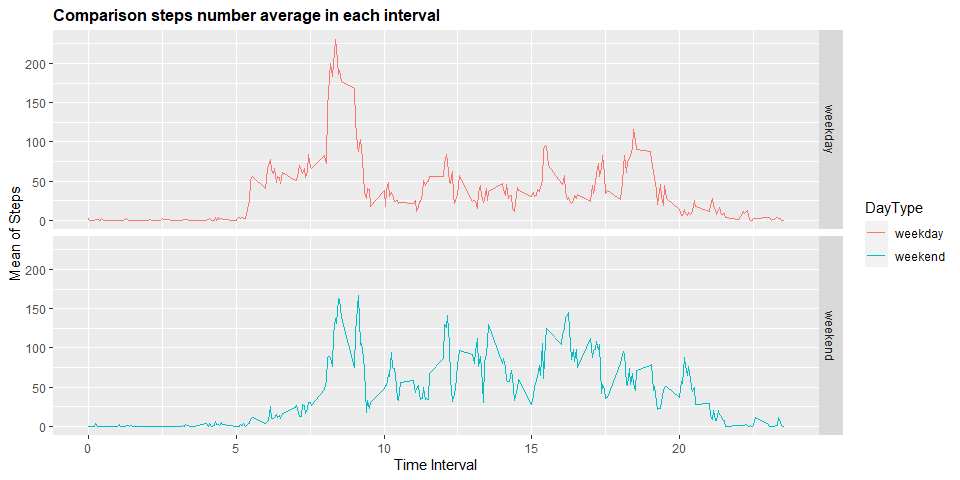

## Introduction

This is my *"Reproducible Research Project 1"* for the John Hopkins Data Science Specialization from  Coursera. For more information go to the [ReadMe](https://github.com/aduran9/RepData_PeerAssessment1/blob/master/README.md) github repo.

<https://github.com/aduran9/RepData_PeerAssessment1>


## Loading and preprocessing the data

After fork and clone the GitHub repository created for this assignment, load the dataset placed in the working directory.


```r
## Unzip and Import Dataset
unzip("activity.zip")
activity <- read.csv("activity.csv", header = TRUE)

## Load libraries
library("dplyr")
library("ggplot2")
## Set properly if different from USA
Sys.setlocale("LC_TIME", "English")
```

```
## [1] "English_United States.1252"
```


```r
## What kind of information we have???
str(activity)
```

```
## 'data.frame':	17568 obs. of  3 variables:
##  $ steps   : int  NA NA NA NA NA NA NA NA NA NA ...
##  $ date    : chr  "2012-10-01" "2012-10-01" "2012-10-01" "2012-10-01" ...
##  $ interval: int  0 5 10 15 20 25 30 35 40 45 ...
```

## What is mean total number of steps taken per day?

1. Calculate the total number of steps taken per day.


```r
DailySteps <- aggregate(activity$steps, list(activity$date), FUN = sum)
colnames(DailySteps) <- c("Date", "Steps")
head(DailySteps, 10)
```

```
##          Date Steps
## 1  2012-10-01    NA
## 2  2012-10-02   126
## 3  2012-10-03 11352
## 4  2012-10-04 12116
## 5  2012-10-05 13294
## 6  2012-10-06 15420
## 7  2012-10-07 11015
## 8  2012-10-08    NA
## 9  2012-10-09 12811
## 10 2012-10-10  9900
```

2. Make a histogram of the total number of steps taken each day.


```r
g <- ggplot(DailySteps, aes(Steps))
g+geom_histogram(boundary = 0, binwidth = 2500, col = "darkgreen", fill = "lightgreen") + ggtitle("Number of daily steps taken") + xlab("Steps") + ylab("Frequency") + theme(plot.title = element_text(face = "bold", size = 12)) + scale_x_continuous(breaks = seq(0,25000,2500)) + scale_y_continuous(breaks = seq(0, 18, 2))
```

<!-- -->

3. Calculate and report the mean and median of the total number of steps taken per day.


```r
## Mean
mean(DailySteps$Steps, na.rm=TRUE)
```

```
## [1] 10766.19
```

```r
## Median
median(DailySteps$Steps, na.rm=TRUE)
```

```
## [1] 10765
```

## What is the average daily activity pattern?

1. Make a time series plot of the 5-minute interval (x-axis) and the average number of steps taken, averaged across all days (y-axis).


```r
TimeSteps <- aggregate(steps ~ interval, data = activity, FUN = mean, na.action = na.omit)
TimeSteps$time <- TimeSteps$interval/100
Alfa <- ggplot(TimeSteps, aes(time, steps))
Alfa + geom_line(col = "blue") + ggtitle("Average steps taken in the interval") + xlab("Time Interval") + ylab ("Steps") + theme(plot.title = element_text(face = "bold", size = 12))
```

<!-- -->

2. Which 5-minute interval, on average across all the days in the dataset, contains the maximum number of steps?


```r
TimeTable <- tbl_df(TimeSteps)
TimeTable %>% select(time, steps) %>% filter(steps == max(TimeTable$steps))
```

```
## # A tibble: 1 x 2
##    time steps
##   <dbl> <dbl>
## 1  8.35  206.
```

## Imputing missing values

1. Calculate and report the total number of missing values in the dataset.


```r
NATable <- tbl_df(activity)
NATable %>% filter(is.na(steps)) %>% summarize(missing_values = n())
```

```
## # A tibble: 1 x 1
##   missing_values
##            <int>
## 1           2304
```

2. Devise a strategy for filling in all of the missing values in the dataset. You could use the mean/median for that day, or the mean for that 5-minute interval, etc.


```r
## FillSteps Contains with information added
activity$FillSteps <- ifelse(is.na(activity$steps), round(TimeSteps$steps[match(activity$interval, TimeSteps$interval)], 0), activity$steps)
```

3. Create a new dataset that is equal to the original dataset but with the missing data filled in.


```r
AllTimeActivity <- data.frame(steps = activity$FillSteps, interval = activity$interval, date = activity$date)
head(AllTimeActivity, n=10)
```

```
##    steps interval       date
## 1      2        0 2012-10-01
## 2      0        5 2012-10-01
## 3      0       10 2012-10-01
## 4      0       15 2012-10-01
## 5      0       20 2012-10-01
## 6      2       25 2012-10-01
## 7      1       30 2012-10-01
## 8      1       35 2012-10-01
## 9      0       40 2012-10-01
## 10     1       45 2012-10-01
```

4.a. Make a histogram of the total number of steps taken each day 


```r
FillDailySteps <- aggregate(AllTimeActivity$steps, list(AllTimeActivity$date), FUN = sum)
colnames(FillDailySteps) <- c("Date", "Steps")
Beta <- ggplot(FillDailySteps, aes(Steps))
Beta + geom_histogram(boundary = 0, binwidth = 2500, col = "darkblue", fill = "green") + ggtitle("Steps taken each day") + xlab("Steps") + ylab("Frequency") + theme(plot.title = element_text(face="bold", size = 12)) + scale_x_continuous(breaks = seq(0,25000,2500)) + scale_y_continuous(breaks = seq(0, 26, 2))
```

<!-- -->

4.b. Calculate and report the mean and median total number of steps taken per day. 


```r
## Mean
mean(FillDailySteps$Steps)
```

```
## [1] 10765.64
```

```r
## Median
median(FillDailySteps$Steps)
```

```
## [1] 10762
```

4.c. Do these values differ from the estimates from the first part of the assignment? 

This values differs in 0.1% to 0.3% percentage from the previous ones, so they are almost the same.

4.d. What is the impact of imputing missing data on the estimates of the total daily number of steps?

There is just one change that is representative and we can notice it, it's between 10,000 and 12,500 steps scaling up from 18 to 26 in frecuency.

## Are there differences in activity patterns between weekdays and weekends?

1. Create a new factor variable in the dataset with two levels – “weekday” and “weekend” indicating whether a given date is a weekday or weekend day.


```r
AllTimeActivity$RealDate <- as.Date(AllTimeActivity$date, format = "%Y-%m-%d")
AllTimeActivity$weekday <- weekdays(AllTimeActivity$RealDate)
AllTimeActivity$DayType <- ifelse(AllTimeActivity$weekday == 'Saturday' | AllTimeActivity$weekday == 'Sunday', 'weekend','weekday')
head(AllTimeActivity, n=10)
```

```
##    steps interval       date   RealDate weekday DayType
## 1      2        0 2012-10-01 2012-10-01  Monday weekday
## 2      0        5 2012-10-01 2012-10-01  Monday weekday
## 3      0       10 2012-10-01 2012-10-01  Monday weekday
## 4      0       15 2012-10-01 2012-10-01  Monday weekday
## 5      0       20 2012-10-01 2012-10-01  Monday weekday
## 6      2       25 2012-10-01 2012-10-01  Monday weekday
## 7      1       30 2012-10-01 2012-10-01  Monday weekday
## 8      1       35 2012-10-01 2012-10-01  Monday weekday
## 9      0       40 2012-10-01 2012-10-01  Monday weekday
## 10     1       45 2012-10-01 2012-10-01  Monday weekday
```

2. Make a panel plot containing a time series plot of the 5-minute interval (x-axis) and the average number of steps taken, averaged across all weekday days or weekend days (y-axis).


```r
DataWeekD <- aggregate(steps ~ interval + DayType, data = AllTimeActivity, FUN = mean, na.action = na.omit)
DataWeekD$time <- DataWeekD$interval/100

Gamma <- ggplot(DataWeekD, aes(x = time, y = steps, color = DayType))
Gamma + geom_line() + facet_grid(DayType ~ .) + ggtitle("Comparison steps number average in each interval") + xlab("Time Interval") + ylab("Mean of Steps") + theme(plot.title = element_text(face = "bold", size = 12))
```

<!-- -->

There it's a little bit of difference, the plots are not the same but they shown a relative similar behavior. 


## 
## 
